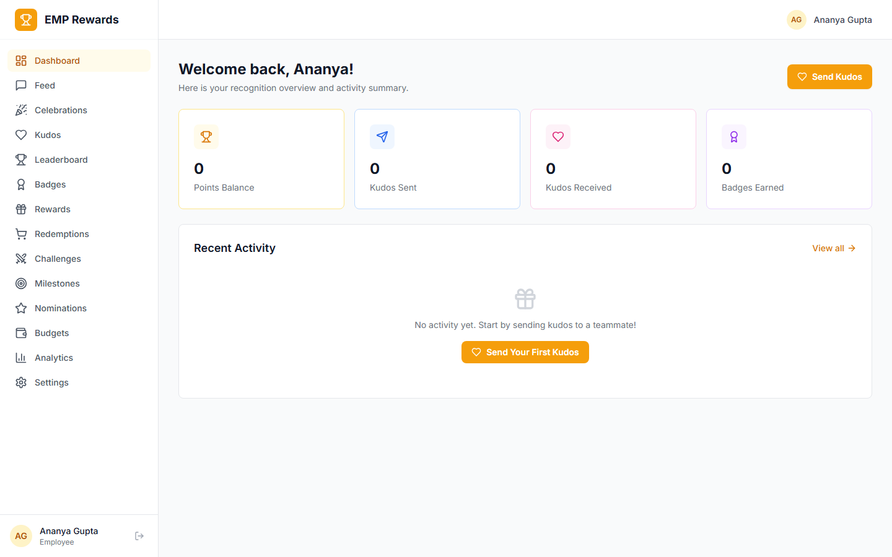
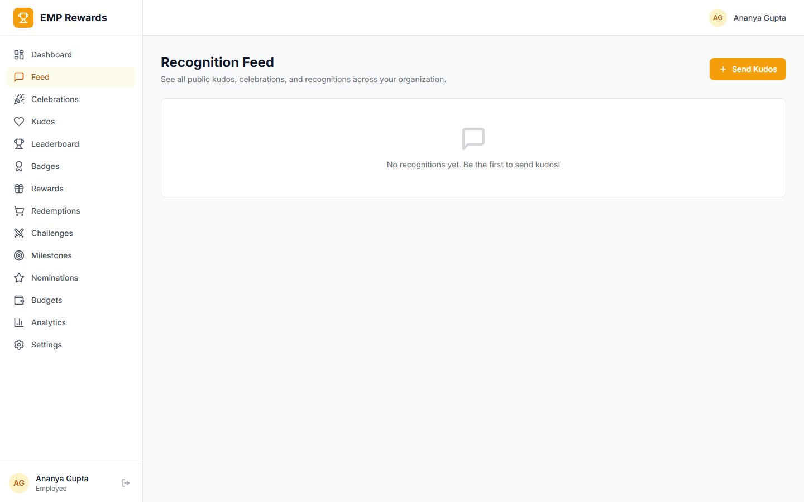
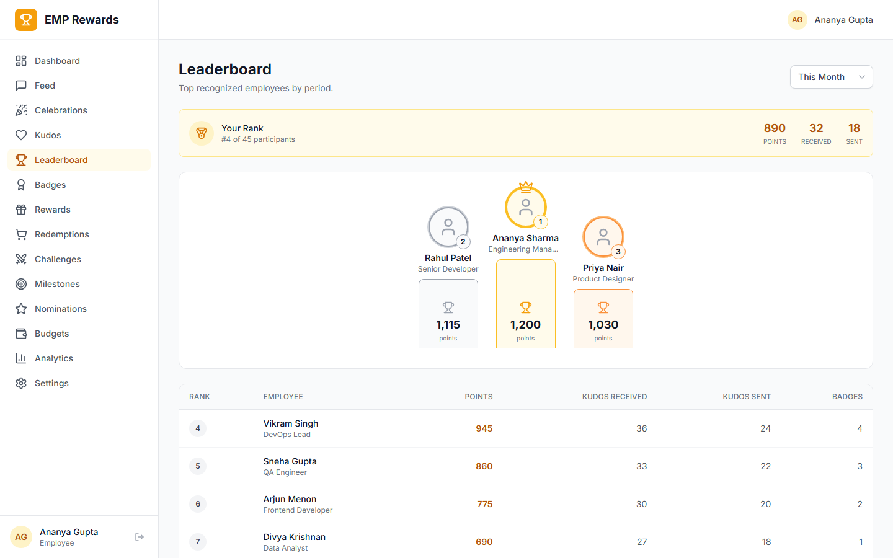
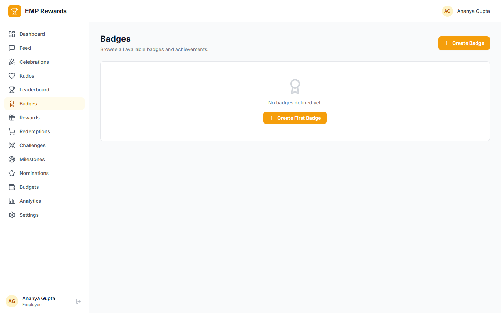
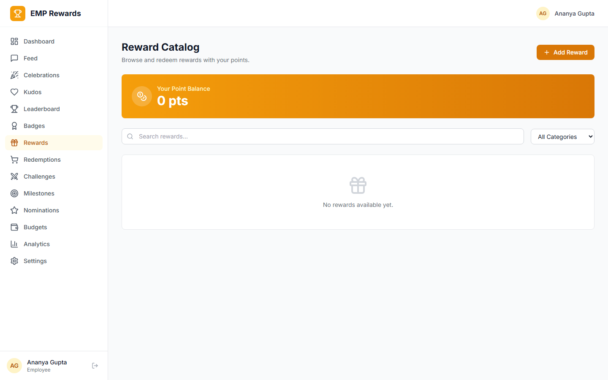
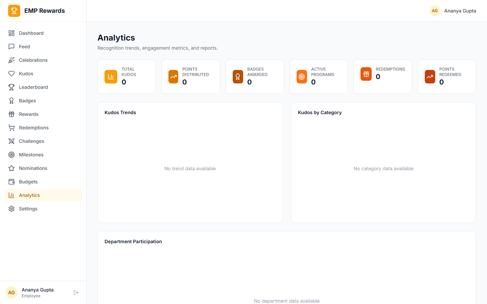
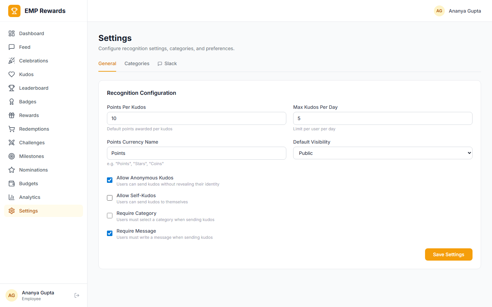

# EMP Rewards

> Recognize and reward top performers to boost morale and retention

[]()
[](LICENSE)
[]()

EMP Rewards is the employee recognition and rewards module of the EmpCloud ecosystem. It provides peer-to-peer kudos, a points system, badges, a reward catalog with redemption workflows, leaderboards, nominations, a social celebration feed, Slack integration, team challenges, automated milestone rewards, and a manager recognition dashboard.

---

## Project Status

**Built** -- all phases implemented and tested.

| Metric | Count |
|--------|-------|
| Database tables | 21+ |
| Frontend pages | 22+ |
| Migrations | 4 |

---

## Features

| Feature | Status | Description |
|---------|--------|-------------|
| Peer Recognition / Kudos | Built | Send kudos to colleagues with message, category, public/private visibility |
| Points System | Built | Earn points for kudos, milestones, achievements; configurable values per org |
| Badges & Achievements | Built | Milestone badges (tenure, kudos count, top performer), custom badges per org |
| Reward Catalog | Built | Redeemable rewards (gift cards, extra PTO, swag, experiences), point-based pricing |
| Redemption & Fulfillment | Built | Redeem points for rewards, approval workflow, fulfillment tracking |
| Leaderboard | Built | Top recognized employees (weekly/monthly/quarterly), department leaderboards |
| Manager Nominations | Built | Nominate employees for special awards (Employee of the Month, etc.) |
| Celebration Wall / Social Feed | Built | Public feed of kudos, achievements, celebrations (birthdays, anniversaries) |
| Budget Management | Built | Set recognition budgets per manager/department, track spend |
| Rewards Analytics | Built | Recognition trends, most recognized values, department participation |
| Integration API | Built | Summary endpoint for EMP Performance module |
| Celebrations Feed | Built | Auto-detect birthdays and work anniversaries from EMP Cloud, wish functionality |
| Slack Integration | Built | Webhook notifications for kudos/badges, /kudos slash command support |
| Team Challenges | Built | Time-bound competitions, progress tracking, auto-award winners |
| Automated Milestone Rewards | Built | Anniversary badges, kudos count milestones, auto-trigger on threshold |
| Manager Recognition Dashboard | Built | Team engagement score, department comparison, recognition recommendations |
| API Documentation | Built | Swagger UI at /api/docs with OpenAPI 3.0 spec |

---

## Screenshots

### Dashboard


### Recognition Feed


### Leaderboard


### Badges


### Reward Catalog


### Analytics


### Settings


---

## Tech Stack

| Layer | Technology |
|-------|------------|
| Runtime | Node.js 20 |
| Backend | Express 5, TypeScript |
| Frontend | React 19, Vite 6, TypeScript |
| Styling | Tailwind CSS, Radix UI |
| Database | MySQL 8 via Knex.js (`emp_rewards` database) |
| Cache / Queue | Redis 7, BullMQ |
| Auth | OAuth2/OIDC via EMP Cloud (RS256 JWT verification) |
| Integrations | Slack Webhooks & Slash Commands |

---

## Project Structure

```
emp-rewards/
  package.json
  pnpm-workspace.yaml
  tsconfig.json
  docker-compose.yml
  .env.example
  packages/
    shared/                     # @emp-rewards/shared
      src/
        types/                  # TypeScript interfaces & enums
        validators/             # Zod request validation schemas
        constants/              # Categories, defaults, permissions
    server/                     # @emp-rewards/server (port 4600)
      src/
        config/                 # Environment configuration
        db/
          connection.ts         # Knex connection to emp_rewards
          empcloud.ts           # Read-only connection to empcloud DB
          migrations/           # 4 migration files
        api/
          middleware/            # auth, RBAC, error handling
          routes/               # Route handlers per domain
        services/               # Business logic per domain
        jobs/                   # BullMQ workers (badge eval, leaderboard, celebrations, milestones, challenges)
        utils/                  # Logger, errors, response helpers
        swagger/                # OpenAPI spec & Swagger UI setup
    client/                     # @emp-rewards/client (port 5180)
      src/
        api/                    # API client & hooks
        components/
          layout/               # DashboardLayout, SelfServiceLayout
          ui/                   # Radix-based UI primitives
          rewards/              # ChallengeCard, MilestoneProgress, EngagementScore, etc.
        pages/                  # Route-based page components
        lib/                    # Auth store, utilities
```

---

## Database Tables (21+)

| Table | Purpose |
|-------|---------|
| `recognition_settings` | Per-org configuration (point values, kudos limits, moderation) |
| `recognition_categories` | Kudos categories (teamwork, innovation, leadership, etc.) |
| `kudos` | Core recognition records (sender, recipient, message, points) |
| `kudos_reactions` | Likes/emoji reactions on kudos |
| `kudos_comments` | Comments on public kudos |
| `point_balances` | Current redeemable balance per user |
| `point_transactions` | Ledger of all point changes (earn/spend) |
| `badge_definitions` | System and org-custom badge templates with criteria |
| `user_badges` | Badges earned by users |
| `reward_catalog` | Redeemable rewards with point cost and stock |
| `reward_redemptions` | Employee redemption requests with approval status |
| `nomination_programs` | Programs like "Employee of the Month" |
| `nominations` | Individual nominations submitted by managers |
| `leaderboard_cache` | Materialized leaderboard rankings (refreshed hourly) |
| `recognition_budgets` | Per-manager/department spend caps |
| `celebration_events` | Birthdays, work anniversaries, promotions |
| `notifications` | In-app notification queue |
| `team_challenges` | Time-bound team competitions with rules and prizes |
| `challenge_participants` | Team/individual participation and progress in challenges |
| `milestone_rules` | Automated milestone trigger definitions (anniversary, kudos count thresholds) |
| `slack_integrations` | Per-org Slack webhook URLs and slash command config |

**4 migrations** across the database schema.

---

## API Endpoints

All endpoints under `/api/v1/`. Server runs on port **4600**.

### Kudos / Recognition
| Method | Path | Description |
|--------|------|-------------|
| POST | `/kudos` | Send kudos |
| GET | `/kudos` | Public kudos feed |
| GET | `/kudos/:id` | Single kudos detail |
| DELETE | `/kudos/:id` | Retract own kudos |
| GET | `/kudos/received` | My received kudos |
| GET | `/kudos/sent` | My sent kudos |
| POST | `/kudos/:id/reactions` | React to kudos |
| POST | `/kudos/:id/comments` | Comment on kudos |

### Points
| Method | Path | Description |
|--------|------|-------------|
| GET | `/points/balance` | My point balance |
| GET | `/points/transactions` | My points history |
| POST | `/points/adjust` | Manual point adjustment (admin) |

### Badges
| Method | Path | Description |
|--------|------|-------------|
| GET | `/badges` | List badge definitions |
| POST | `/badges` | Create custom badge (admin) |
| GET | `/badges/my` | My earned badges |
| POST | `/badges/award` | Manually award badge (admin/manager) |

### Rewards Catalog
| Method | Path | Description |
|--------|------|-------------|
| GET | `/rewards` | Browse catalog |
| POST | `/rewards` | Create reward (admin) |
| POST | `/rewards/:id/redeem` | Redeem points for reward |

### Redemptions
| Method | Path | Description |
|--------|------|-------------|
| GET | `/redemptions` | List all redemptions (admin) |
| GET | `/redemptions/my` | My redemptions |
| PUT | `/redemptions/:id/approve` | Approve redemption |
| PUT | `/redemptions/:id/fulfill` | Mark fulfilled |

### Nominations
| Method | Path | Description |
|--------|------|-------------|
| GET | `/nominations/programs` | List nomination programs |
| POST | `/nominations/programs` | Create program (admin) |
| POST | `/nominations` | Submit nomination |
| PUT | `/nominations/:id/review` | Review nomination (admin) |

### Leaderboard
| Method | Path | Description |
|--------|------|-------------|
| GET | `/leaderboard` | Org leaderboard (by period) |
| GET | `/leaderboard/department/:deptId` | Department leaderboard |
| GET | `/leaderboard/my-rank` | My current rank |

### Celebrations Feed
| Method | Path | Description |
|--------|------|-------------|
| GET | `/celebrations` | Upcoming birthdays and work anniversaries |
| GET | `/celebrations/feed` | Combined celebration + kudos social feed |
| POST | `/celebrations/:id/wish` | Send a wish for a celebration |

### Slack Integration
| Method | Path | Description |
|--------|------|-------------|
| GET | `/slack/config` | Get Slack integration config |
| PUT | `/slack/config` | Update webhook URL and settings |
| POST | `/slack/test` | Send test notification to Slack |
| POST | `/slack/slash-command` | Handle /kudos slash command from Slack |

### Team Challenges
| Method | Path | Description |
|--------|------|-------------|
| GET | `/challenges` | List active and past challenges |
| POST | `/challenges` | Create team challenge (admin) |
| GET | `/challenges/:id` | Get challenge detail with leaderboard |
| POST | `/challenges/:id/join` | Join a challenge |
| GET | `/challenges/:id/progress` | Get progress for all participants |
| POST | `/challenges/:id/complete` | End challenge and auto-award winners |

### Automated Milestone Rewards
| Method | Path | Description |
|--------|------|-------------|
| GET | `/milestones/rules` | List milestone trigger rules |
| POST | `/milestones/rules` | Create milestone rule (admin) |
| PUT | `/milestones/rules/:id` | Update milestone rule |
| GET | `/milestones/history` | View triggered milestone awards |

### Manager Recognition Dashboard
| Method | Path | Description |
|--------|------|-------------|
| GET | `/manager/dashboard` | Team engagement score and recognition summary |
| GET | `/manager/team-comparison` | Department-level recognition comparison |
| GET | `/manager/recommendations` | AI-powered recognition recommendations |

### Other Endpoints
- **Celebrations**: Upcoming celebrations, combined social feed
- **Settings**: Org recognition settings, category CRUD
- **Budgets**: CRUD budgets, usage tracking
- **Notifications**: List, mark read, unread count
- **Analytics**: Overview, trends, categories, departments, top recognizers, budget utilization
- **Integration**: `/integration/user/:userId/summary` for EMP Performance
- **API Docs**: Swagger UI at `/api/docs`

---

## Frontend Pages (22+)

### Admin / Manager Views
| Route | Page | Description |
|-------|------|-------------|
| `/dashboard` | Dashboard | Overview stats, recent activity, quick send kudos |
| `/feed` | Social Feed | Public celebration wall / social feed |
| `/kudos` | Kudos Management | All kudos with moderation tools |
| `/leaderboard` | Leaderboard | Org-wide leaderboard with period/dept filters |
| `/badges` | Badge Management | Create/manage badge definitions |
| `/rewards` | Reward Catalog Management | Manage reward catalog |
| `/redemptions` | Redemption Management | Approve/reject/fulfill redemptions |
| `/nominations` | Nomination Management | Manage programs, review nominations |
| `/budgets` | Budget Management | Set and track recognition budgets |
| `/challenges` | Team Challenges | Create and manage time-bound competitions |
| `/challenges/:id` | Challenge Detail | Progress tracking, participant leaderboard |
| `/milestones` | Milestone Rules | Configure automated milestone reward triggers |
| `/manager-dashboard` | Manager Recognition Dashboard | Team engagement score, comparison, recommendations |
| `/slack` | Slack Integration | Configure webhook, test connection, slash command setup |
| `/analytics` | Analytics | Charts: trends, categories, departments, ROI |
| `/settings` | Settings | Org recognition settings, categories |

### Employee Self-Service
| Route | Page | Description |
|-------|------|-------------|
| `/my` | My Summary | Points balance, recent kudos, badges |
| `/my/kudos` | My Kudos | Send kudos, view sent/received |
| `/my/badges` | My Badges | Earned badges, progress toward next |
| `/my/rewards` | Reward Catalog | Browse and redeem rewards |
| `/my/redemptions` | My Redemptions | Track redemption status |
| `/my/notifications` | Notifications | Notification center |

---

## Getting Started

### Prerequisites
- Node.js 20+
- pnpm 9+
- MySQL 8+
- Redis 7+
- EMP Cloud running (for authentication)

### Install
```bash
git clone https://github.com/anthropic/emp-rewards.git
cd emp-rewards
pnpm install
```

### Environment Setup
```bash
cp .env.example .env
# Edit .env with your database credentials and EMP Cloud URL
```

### Docker
```bash
docker-compose up -d
```

### Development
```bash
# Run all packages in development mode
pnpm dev

# Run individually
pnpm --filter @emp-rewards/server dev    # Server on :4600
pnpm --filter @emp-rewards/client dev    # Client on :5180

# Run migrations
pnpm --filter @emp-rewards/server migrate
```

Once running, visit:
- **Client**: http://localhost:5180
- **API**: http://localhost:4600
- **API Documentation**: http://localhost:4600/api/docs

---

## License

This project is licensed under the [AGPL-3.0 License](LICENSE).
